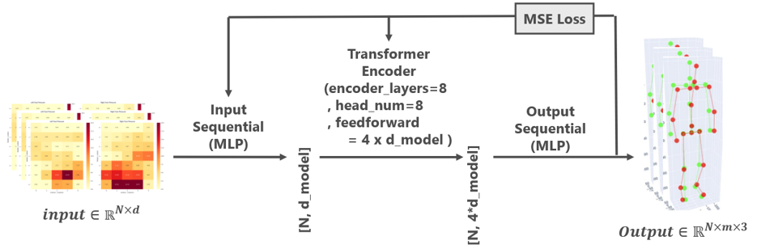
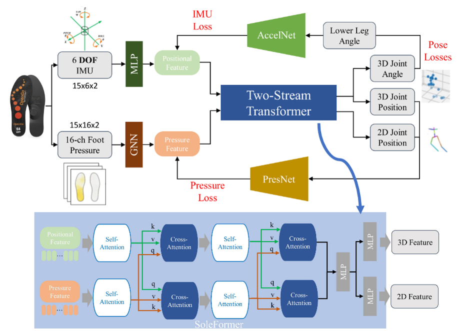
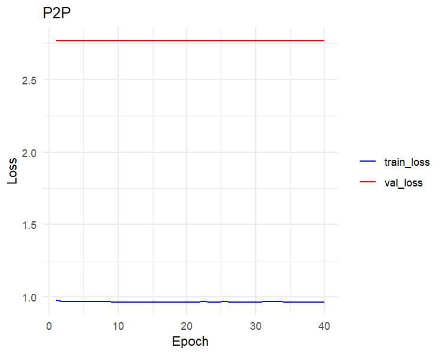
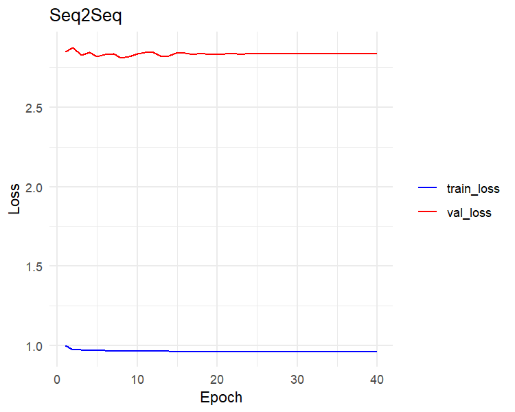
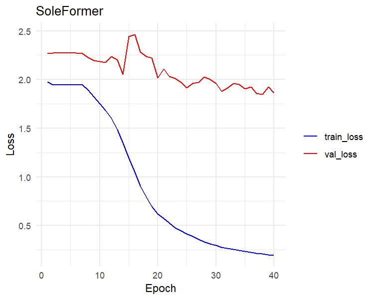
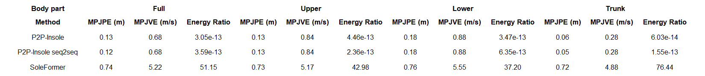
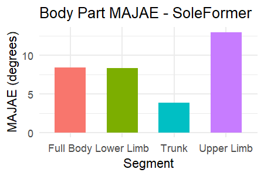
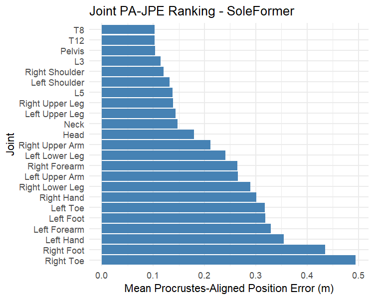
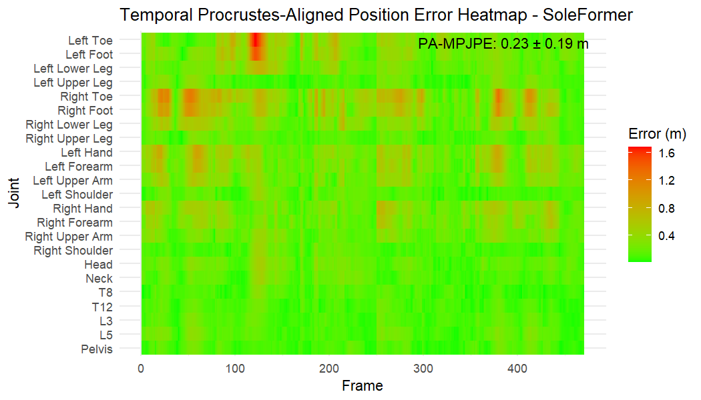

```{r setup, include=FALSE}
knitr::opts_chunk$set(echo = TRUE)
```
<br>
<br>
<br>
GitHub repository: https://github.com/JoelSin-student/singer.joel

<!-- Word count: `r as.integer(sub("(\\d+).+$", "\\1", system(sprintf("wc -w %s", knitr::current_input()), intern = TRUE))) - 319` -->

# Introduction

## Background and motivation

Sport performance in kickboxing is lacking comprehensive analyses of its kinematics and kinetics determinants. At the same time, the access to this information for indiviudal athletes would be very valuable for coaches, as they could more accurately: evaluate athletes' mechanical aptitudes (e.g., speed, force transfer efficiency), monitor training load and performance (e.g., through external load), as well as optimize the training process and prescribe targeted exercises (e.g., by noticing improvements for a certain type). Through its objective and rules, kickboxing is also an activity with high risk of health issues, such as traumatic brain injuries (TBI) and musculoskeletal injuries. Therefore, the development of methods to monitor and analyze kickboxing performance, not only in the lab but also where it is practiced, is crucial for both performance enhancement and injury prevention.

Wearables are a type of sensors defined by their portability on humans in the ecological world. Although already widely used in the sport context, especially in team sports to record displacements, kinematics of complex activities such as combat sports cannot be assessed with only locomotion. Video analysis also fails in the combat sports context, as the athletes are often occluded, colours can blend and the movements are very fast. On the other hand, insole sensors measuring ground pressure and feet kinematics are easy to implement in the field, and can provide detailed information on the foot-ground interactions defining a good part of whole-body kinetic chains. Inertial measurement units (IMU) also can give interesting per-segment kinematics information, and are small enough to be worn without burden if not numerous.

To minimize the burden of wearing multiple sensors, and to be able to monitor athletes in the field, it is necessary to develop methods to estimate whole-body kinematics and kinetics from a reduced number of sensors. In this context, deep learning algorithms have shown promising results in pose estimation from wearable data such as insole pressure and accelerations. However, no attempt has been made in highly-complex activities such as combat sports. The KickCap dataset, which includes synchronized data from multiple sensors during kickboxing activities, provides a unique opportunity to develop and evaluate deep learning models for this purpose.

Thus, the aim of these first analyses is to test the performance of existing pose estimation deep learning algorithms for kickboxing-specific motion. From this work, we want to extract orientations on the most suitable pipelines for this type of data, to ultimately develop a kickboxing-specific algorithm.


## Dataset

The KickCap dataset is composed of 3D motion capture data, insole pressure and IMU data collected from 5 (4 males) experienced kickboxers performing five different situations of 3 min each. In this repository, we use test data of 2501 frames for training, and 501 frames for test, coming from the same situation (001CcSs_3_shadow), but at the two ends of it.

### Motion capture data
#### System 
Awinda system (Xsens Technologies) in full-body no-hand configuration: 15 9-DoF inertial and magnetic measurement units (IMMU) and the MVN software (2025.01).

#### Data
Three-dimensional kinematics of 23 joints, sampled at 60 Hz. The MVN software executes a high-quality data processing to ensure accuracy and smoothness.

#### Data used
Positions of the 23 joints in the global coordinate system and their corresponding angles.

### Insole device data
#### System
OpenGo insole system (Moticon ReGo AG): 16 pressure sensors, 6-DOF IMU (per insole), and the OpenGo mobile and computer softwares.

#### Data
Pressure on a 16-sensor grid, center of pressure, vertical ground reaction force, 3D accelerations and angular velocities of the foot, sampled at 100 Hz.

#### Data used
Pressure on the 16-sensor grid, 3D accelerations and angular velocities of the foot: 22 features per foot, 44 in total.


# Analyses

We use Python code in the form of plain Python scripts and Jupyter notebooks for data preprocessing, model training, prediction and skeletons visualization. The `main.ipynb` notebook contains the main pipeline for the three models, with adequat instructions. Be sure to install the kickcap environment specified in the `environment.yml` file prior to running. Be wary of the running time of the full main.ipynb notebook, that can be higher than 3 hours on a performant portable computer without a dedicated graphics card. We kept the necessary files to run the evaluation procedure if needed.

We use an Rmarkdown file, `main.Rmd` for the evaluation of the predictions. Specifically, it sorts all plots for each model, which can be overwhelming to watch through. We selected the most representative ones in the Results section below.


## Models

### Architecture overview

Three models were tested for pose estimation from insole data. 

The P2P-Insole model of [Watanabe et al. (2025)](https://doi.org/10.48550/arXiv.2505.00755) consists in a simple transformer-encoder with regression head architecture described in Figure 1 and which code is publicly available (https://github.com/onya31-git/P2P-Insole). 

```{r, echo=FALSE, fig.cap="Figure 1: P2P-Insole architecture. N: number of inputed frames; d: number of input features; MLP: multilayer perceptron; MSE: mean squared error; m: number of joints", out.width="70%", fig.align='center'}

```

The second model was an extension of the P2P-Insole architecture, which we called seq2seq, where the original sequence-to-frame inference was replaced by a sequence-to-sequence during training and where the residual skip present in the former is removed, resulting in a direct mapping.

The third model (Figure 2) was a more complex architecture taken from [Wu et al. (2024)](https://doi.org/10.1145/3654777.3676418), which name is SoleFormer. Multiple enhancements are made compared to P2P-Insole. (i) Instead of inputing features all at once in a single pipe, it uses a specialized network for the pressure features (graph neural network), because they can be represented as a graph from which relations between sensors are non-trivial (e.g., if a sensor is activated, the ones nearby have more probability to also be). (ii) The two types of feature are being encoded in two streams that communicate through cross-attention, enabling the identification of redundant information (e.g., when the foot is rolling on the ground, a specific pattern in the pressure sensors equal the rolling gyroscope data of the IMU). (iii) The loss function is composed of three components: the classical pose loss (MSE), and an IMU and pressure losses that are being calculated from the recomputation of IMU and pressure features data from prediction thanks to two pre-trained auxiliary networks.


```{r, echo=FALSE, fig.cap="Figure 2: SoleFormer architecture. MLP: multilayer perceptron; GNN: graph neural network; AccelNet: auxiliary MLP for IMU features recomputation; PresNet: auxiliary MLP for pressure features recomputation", out.width="70%", fig.align='center'}

```

You will find in Table 1 the hyperparameters used for each model for this test with the small subset of data we provide.

| Model | d_model | Heads | Encoder layers | Dropout | Epochs | Batch size | Learning rate | Weight decay | Sequence length | Input dimension | Output dimension | Parameters number |
|:-----:|:-------:|:-----:|:--------------:|:-------:|:------:|:----------:|:-------------:|:------------:|:---------------:|:-----------------:|:----------------:|:-----------------:|
| P2P-Insole | 512 | 8 | 8 | 0.1 | 40 | 64 | 5e-4 | 1e-3 | 32 | 44 | 69 | 26M |
| Seq2seq | 512 | 8 | 8 | 0.1 | 40 | 64 | 5e-4 | 1e-3 | 32 | 44 | 69 | 25.8M |
| SoleFormer | 512 | 8 | 2 | 0.1 | 40 | 64 | 3e-4 | 1e-4 | 32 | 44 | 135 (joints+angles) | 10.9M |
<p style="text-align: center;">Table 1: Hyperparameters for each model on the current run. Notice the fewer number of parameters for SoleFormer.</p>


## Preprocessing

### First stage: clean files to handle
Below are the shared preprocessing steps between the three models.

1. Insole
- Resampling of the insole data to 60 Hz to match the motion capture data.

- Missing values filling: interpolation up to 0.1 s gaps (6 frames) and forward/backward filling of 2 values for larger gaps, median fill in last resort.

- Unused features removal.

2. Motion capture
- Extract joints' positions tabs from MVN export.

- Synchronization of the motion capture and insole data using a shared 60 Hz time-grid and interpolation.

- Translational normalization to pelvis position.

In addition, angles from the MVN export file are integrated in the clean data of the motion capture data for the SoleFormer algorithm.


### Second stage: features preprocessing
This stage corresponds to the features preprocessing before being inputed in the models, and is shared between the three models. The main steps are:

- insole split into pressure + IMU (+ optional time feature).

- Optional Gaussian smoothing before scaling.

- Base scaling strategy for inputs: pressure/IMU with MinMaxScaler, joints' positions targets with StandardScaler.

- Optional time normalization per segment.

- Optional derivative feature expansion (Savitzky-Golay + gradients + z-score).

- Concatenation of pressure and IMU features (tensor splitting happens inside the model for SoleFormer).


## Training, prediction and visualization

The training of a generative deep neural network like these ones is done by initializing the parameters randomly, then passing a batch of data forward through the network to get predictions. Then, calculating the loss between the predictions and the ground truth, and then backpropagating the error to update the parameters (using gradient descent properties). This process is repeated for the whole training dataset (divided in a fixed number of batches), except a random subset defined by the dropout hyperparameter (proportion of the total training data). These droped data is used when all the other data have been passed and enhanced the weights inside the neural network as a validation subset. The loss computed from this subset prediction is used to select the epoch at which the model has its theoric optimal point between insufficient learning and overfitting. This process is repeated for a number of epochs, where the weights are updated at each epoch, and the model is saved at the end of each epoch. The best model is then selected based on the validation loss.

The loss functions used for P2P-Insole and seq2seq are simply the mean squared error (MSE) between the predicted and ground truth joints' positions. For SoleFormer, the loss function is a weighted sum of three components (equation 1): the sub-loss function between the predicted and ground truth joints' 2D and 3D positions (equation 2), the MSE between the recomputed IMU features from the prediction and the original IMU features, and the MSE between the recomputed pressure features from the prediction and the original pressure features. 

$$
\mathcal{L} = \alpha \cdot \mathcal{L}_{\text{pose}} + \beta \cdot \text{MSE}_{\text{IMU}} + \gamma \cdot \text{MSE}_{\text{pressure}} (1)
$$
$$
\mathcal{L}_{\text{pose}} = \omega_{2D} \cdot  \text{MSE}_{(\hat{p_{xy}}, p_{xy})} + \omega_{3D} \cdot \text{MSE}_{(\hat{p_{xyz}}, p_{xyz})} (2)
$$

The prediction is done by loading the best model and passing the test data forward through the network. The predicted joints' positions are then compared to the ground truth, and visualised in a skeleton format for better interpretation. The visualisation is done by plotting the predicted and ground truth skeletons on top of each other, with different colors for each one, and with a time slider to see the evolution of the prediction over time.


## Evaluation

The evaluation of the quality of the predictions is done first by visual inspection on the animations produced by the visualisation process. We directly see the ground-truth data and the prediction on the same animation sharing the same time-space scale. This is the best way to rapidly understand the strengths and weaknesses of the models, as well as to identify specific patterns of errors. 

Indeed, quantitative metrics can miss behaviours that seem obvious to the human eye, especially for the human motion that we see everyday. Nonetheless, when predictions of different models are ver close to one another, quantitative metrics are very useful to distinguish the strengths of each model. For instance, a model can accurately describe the position of the joints, but lack smoothness (as understood by the velocity of movements).

We use the following metrics for the quantitative evaluation of the predictions. We divide them in two classes, static metrics and realism metrics.

1. Static metrics: 
- MPJPE: mean per joint position error (m), 
- PA-MPJPE: procrustes-aligned mean per joint position error (m),
- MAJAE: mean absolute joint angle error (degrees), 
- MPJVE: mean per joint velocity error (m/s).

2. Realism metrics:
- MER: motion enery ratio (m²/s²),
- VelCorr: velocity correlation.

The static metrics are calculated from the difference between ground-truth and prediction, averaged over all frames and selected joints. The selected joints can be the whole-body or segments to isolate specific errors. In the case of MPJPE, PA-MPJPE and MPJVE, the difference is calculated on the Euclidian 3D distance. For MAJAE, the difference is calculated on the absolute value of the angle error. For PA-MPJPE, a procrustes alignment is done before calculating the error, which consists in finding the optimal translation, rotation and scaling to align the predicted skeleton to the ground-truth skeleton. This metric is useful to evaluate the quality of the predicted pose independently of the global position and orientation of the skeleton. For MPJVE, the velocity is calculated as the difference between the positions of the joints at two consecutive frames, multiplied by the sampling rate. This metric is useful to evaluate the smoothness of the predicted motion.

The realism metrics are calculated from the whole time-series. In the case of MER, it is calculated as the ratio between the mean motion energy of the predicted motion and the mean motion energy of the ground-truth motion. The motion energy is calculated as the sum of the squared velocities of the joints. This metric is useful to evaluate if the predicted motion has a similar activity as the ground-truth. In the case of VelCorr, it is calculated as the correlation between the velocities of the joints in the predicted motion and the velocities of the joints in the ground-truth motion. This metric reflects the concordance of motion between the prediction and ground-truth, a value of 1 corresponding to the same exact motion (while the predicted skeleton can be at a different position in space or have different dimensions).


# Results

## Learning curves
The learning of P2P-Insole and its sequence-to-sequence variant is very poor. On the other hand, SoleFormer shows a standard learning curve, also showing that 40 epochs are not enough for an optimal learning.

```{r, echo=FALSE, fig.cap="Figure 3: Learning curve for P2P-Insole. Train loss: training loss; Val loss: validation loss", out.width="50%", fig.align='center'}

```

```{r, echo=FALSE, fig.cap="Figure 4: Learning curve for seq2seq. Train loss: training loss; Val loss: validation loss", out.width="50%", fig.align='center'}

```

```{r, echo=FALSE, fig.cap="Figure 5: Learning curve for SoleFormer. Train loss: training loss; Val loss: validation loss", out.width="50%", fig.align='center'}

```


## Visualisation
By visual inspection of the animations, we can see that the P2P-Insole and seq2seq models renders an average pose, without any dynamics. The SoleFormer model presents a less realistic skeleton, but that is highly dynamic, exhibiting sometimes motion patterns similar to the ground-truth. 


```{r results='asis', echo=FALSE}
path <- "results/animation/Animation_001CcSs_3_shadow_test_soleformer.html"
html_text <- paste(readLines(path, warn = FALSE, encoding = "UTF-8"), collapse = "\n")

iframe_id <- "animation_embed_1"

js_resize <- paste0(
  "(function(){",
  "var iframe = document.getElementById('", iframe_id, "');",
  "if (!iframe) return;",
  "function resizeEmbed(){",
  "  var doc = iframe.contentDocument || (iframe.contentWindow && iframe.contentWindow.document);",
  "  if (!doc || !doc.body || !doc.documentElement) return;",
  "  var body = doc.body;",
  "  var html = doc.documentElement;",
  "  html.style.overflow = 'hidden';",
  "  body.style.overflow = 'hidden';",
  "  body.style.margin = '0';",
  "  var contentWidth = Math.max(body.scrollWidth, html.scrollWidth);",
  "  var contentHeight = Math.max(body.scrollHeight, html.scrollHeight);",
  "  var availableWidth = iframe.clientWidth;",
  "  var scale = (contentWidth > 0) ? Math.min(1, availableWidth / contentWidth) : 1;",
  "  body.style.transformOrigin = 'top left';",
  "  body.style.transform = 'scale(' + scale + ')';",
  "  iframe.style.height = Math.ceil(contentHeight * scale + 8) + 'px';",
  "}",
  "iframe.addEventListener('load', function(){",
  "  resizeEmbed();",
  "  setTimeout(resizeEmbed, 200);",
  "  setTimeout(resizeEmbed, 800);",
  "});",
  "window.addEventListener('resize', resizeEmbed);",
  "})();"
)

embed <- htmltools::tagList(
  htmltools::tags$iframe(
    id = iframe_id,
    srcdoc = html_text,
    width = "100%",
    style = "border:none;display:block;overflow:hidden;",
    scrolling = "no"
  ),
  htmltools::tags$script(htmltools::HTML(js_resize))
)

cat(as.character(embed))
```
<p style="text-align: center;">Animation 1: SoleFormer prediction (blue) vs ground-truth (red) for the shadow test subset (8.33 sec) of the 001CcSs participant.</p>


```{r results='asis', echo=FALSE}
path <- "results/animation/Animation_001CcSs_3_shadow_test_original.html"
html_text <- paste(readLines(path, warn = FALSE, encoding = "UTF-8"), collapse = "\n")

iframe_id <- "animation_embed_2"

js_resize <- paste0(
  "(function(){",
  "var iframe = document.getElementById('", iframe_id, "');",
  "if (!iframe) return;",
  "function resizeEmbed(){",
  "  var doc = iframe.contentDocument || (iframe.contentWindow && iframe.contentWindow.document);",
  "  if (!doc || !doc.body || !doc.documentElement) return;",
  "  var body = doc.body;",
  "  var html = doc.documentElement;",
  "  html.style.overflow = 'hidden';",
  "  body.style.overflow = 'hidden';",
  "  body.style.margin = '0';",
  "  var contentWidth = Math.max(body.scrollWidth, html.scrollWidth);",
  "  var contentHeight = Math.max(body.scrollHeight, html.scrollHeight);",
  "  var availableWidth = iframe.clientWidth;",
  "  var scale = (contentWidth > 0) ? Math.min(1, availableWidth / contentWidth) : 1;",
  "  body.style.transformOrigin = 'top left';",
  "  body.style.transform = 'scale(' + scale + ')';",
  "  iframe.style.height = Math.ceil(contentHeight * scale + 8) + 'px';",
  "}",
  "iframe.addEventListener('load', function(){",
  "  resizeEmbed();",
  "  setTimeout(resizeEmbed, 200);",
  "  setTimeout(resizeEmbed, 800);",
  "});",
  "window.addEventListener('resize', resizeEmbed);",
  "})();"
)

embed <- htmltools::tagList(
  htmltools::tags$iframe(
    id = iframe_id,
    srcdoc = html_text,
    width = "100%",
    style = "border:none;display:block;overflow:hidden;",
    scrolling = "no"
  ),
  htmltools::tags$script(htmltools::HTML(js_resize))
)

cat(as.character(embed))
```
<p style="text-align: center;">Animation 2: P2P-Insole prediction (blue) vs ground-truth (red) for the shadow test subset (8.33 sec) of the 001CcSs participant.</p>


```{r results='asis', echo=FALSE}
path <- "results/animation/Animation_001CcSs_3_shadow_test_simple_seq2seq.html"
html_text <- paste(readLines(path, warn = FALSE, encoding = "UTF-8"), collapse = "\n")

iframe_id <- "animation_embed_3"

js_resize <- paste0(
  "(function(){",
  "var iframe = document.getElementById('", iframe_id, "');",
  "if (!iframe) return;",
  "function resizeEmbed(){",
  "  var doc = iframe.contentDocument || (iframe.contentWindow && iframe.contentWindow.document);",
  "  if (!doc || !doc.body || !doc.documentElement) return;",
  "  var body = doc.body;",
  "  var html = doc.documentElement;",
  "  html.style.overflow = 'hidden';",
  "  body.style.overflow = 'hidden';",
  "  body.style.margin = '0';",
  "  var contentWidth = Math.max(body.scrollWidth, html.scrollWidth);",
  "  var contentHeight = Math.max(body.scrollHeight, html.scrollHeight);",
  "  var availableWidth = iframe.clientWidth;",
  "  var scale = (contentWidth > 0) ? Math.min(1, availableWidth / contentWidth) : 1;",
  "  body.style.transformOrigin = 'top left';",
  "  body.style.transform = 'scale(' + scale + ')';",
  "  iframe.style.height = Math.ceil(contentHeight * scale + 8) + 'px';",
  "}",
  "iframe.addEventListener('load', function(){",
  "  resizeEmbed();",
  "  setTimeout(resizeEmbed, 200);",
  "  setTimeout(resizeEmbed, 800);",
  "});",
  "window.addEventListener('resize', resizeEmbed);",
  "})();"
)

embed <- htmltools::tagList(
  htmltools::tags$iframe(
    id = iframe_id,
    srcdoc = html_text,
    width = "100%",
    style = "border:none;display:block;overflow:hidden;",
    scrolling = "no"
  ),
  htmltools::tags$script(htmltools::HTML(js_resize))
)

cat(as.character(embed))
```
<p style="text-align: center;">Animation 3: Seq2seq prediction (blue) vs ground-truth (red) for the shadow test subset (8.33 sec) of the 001CcSs participant.</p>


## Quantitative evaluation

The MER (Enegy Ratio in Table 2) is agreeing with visual inspection: P2P-Insole and seq2seq do not present any dynamics compared to the ground-truth (almost 0). An additional observation is that SoleFormer exhibits a really high MER compared to ground-truth.

```{r, echo=FALSE, fig.cap="Table 2: Summary table for the performance of the three models considering three key metrics and four sets of joints: all joints, upper limb joints, lower limb joints and trunk joints (including neck and head)", out.width="100%", fig.align='center'}

```

Figure 6 and Figure 7 show that the trunk joints are the best predicted, which was expected as we normalize translations to the pelvis joint. The upper limb and feet joints demonstrated the highest errors in terms of position and angles.

```{r, echo=FALSE, fig.cap="Figure 6: MAJAE for different body segments of the SoleFormer prediction", out.width="50%", fig.align='center'}

```


```{r, echo=FALSE, fig.cap="Figure 7: PA-JPE for each joint for the SoleFormer prediction", out.width="100%", fig.align='center'}

```

We can see that the errors are localized at specific temporal periods (Figure 8), which correspond to specific movements. Especially, the limb endpoints (hands, feet) demonstrate the highest position errors during the kicking and punching phases.

```{r, echo=FALSE, fig.cap="Figure 8: Temporal heatmap of PA-JPE for each joint", out.width="100%", fig.align='center'}

```


# Discussion and perspectives

Discussion

We can obviously observe that the P2P-Insole and its sequence-to-sequence version are not learning as much as we would expect. It relates to their animations, where we could see that the model is not able to learn the dynamic mapping between feet data and whole-body motion (even with the full dataset, not shown). The model is thus stuck into always predicting an average pose, whatever the input. The SoleFormer, on the other hand, is showing standard expected learning curves. However, when trained with the full dataset or even with only the data of one participant (not shown), it outputs similarly as the two former. 

The training data provided in this repository corresponds to roughly 40 seconds of complex motion: shadow-boxing: the participant is free to simulate a fight in the air. The algorithm is still capable to learn from that and infer quite well 10 seconds at the other end of the same shadow-boxing situation - considering the training dataset size and the very poor results of the other models. The motion complexity seems to be the major issue encountered with our dataset, compared to the literature. Indeed, the movements previously investigated corresponded to daily-life situations or sports where movements are quite similar to each other or where feet motion is easily relatable to the whole movement (golf, skiing, table tennis). In lieu, the kickboxing activity is characterized by a large variety of movements, that often exhibit for a same movement different feet patterns, or for a same feet pattern different whole-body movements. 

In fact, this project recently uncovered the question about what is a kickboxing movement, more specifically: can we classify kickboxing movements? Indeed, among our current perspectives, we are planning to adjust the weights applied to features at the input of the model in function of the movement performed. Through this method, we hope to optimise the inference by emphasizing the power of the most descriptive features of each technique (previously defined by PCA or machine learning classifiers). However, a kickboxing movement is always comprised in a bigger context: a combination, a displacement, a shock, a defense, etc. The movement is often "beginning" - "emerging" would be a better word - while another movement is being performed. It is thus difficult and maybe incorrect to clearly distinguish one movement from another in a sequence of frames. Uncertainty theory could be a good way to deal with this issue, by allowing a "soft" classification of movements.

Going back to our results, we can see that SoleFormer, that has a more elegant architecture, is able to learn more. Although its number of parameters is less than half the number of the other models. This is a good example of how the architecture of a model can be more important than its size, and making its architecture suits the data in input as well as the wanted output is actually part of what we are investigating through those literature models' trials. Our final objective is to design from scratch a model specific to kickboxing and the measurement material we are using. The enhancements described in the Analyses$Models section are good examples of the type of adjustments we can make to the architecture to better suit our data. 


# Conclusion

All in all, these analyses using algorithms of the literature revealed that kickboxing motion are very complex in regards to feet pressure and kinematics. A simple transformer model, even given a lot of data and having more than two times more parameters, performs worse than a more complex and light architecture. It emphasizes the importance of the architecture development, that should compell with the specifities of the data and the activity. The next steps are to test extreme hyperparameters configurations, find the precise way of integrating our supplementary data (EMG, video) and begin to develop a custom model from scratch.


